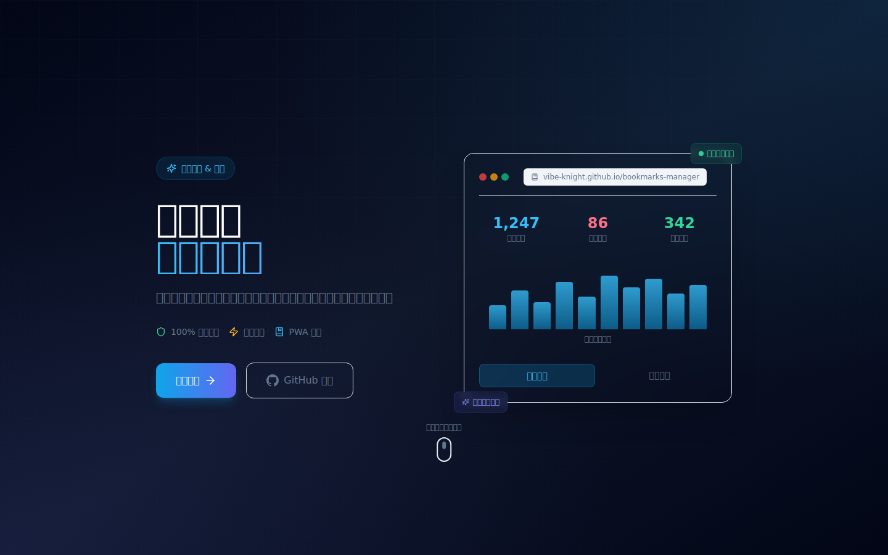
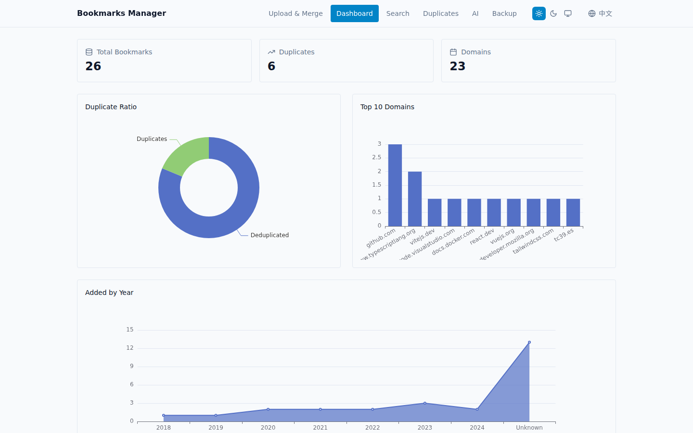
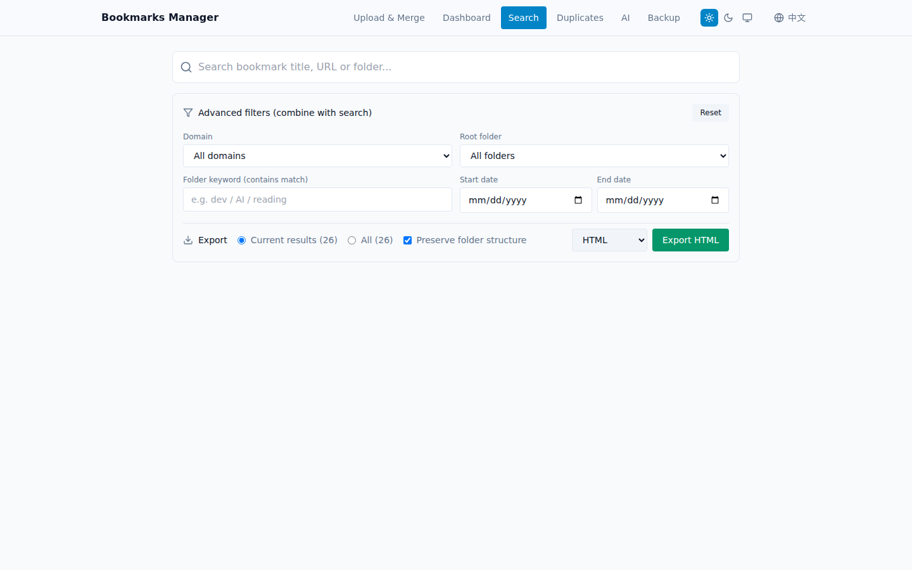
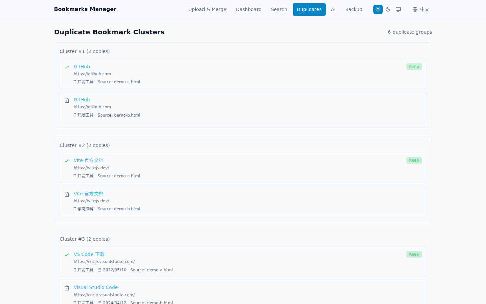

# Bookmarks Manager

**纯前端、无后端、数据不出浏览器的书签整理 PWA。** 导入浏览器导出的书签文件，在本地完成合并、去重、搜索、自动分类和导出。

[GitHub 仓库](https://github.com/build-workbench/bookmarks-manager)

## 功能截图

| 落地页 | 统计仪表盘 |
| --- | --- |
|  |  |

| 全文搜索 | 重复检测 |
| --- | --- |
|  |  |

## 它解决什么问题

很多书签工具不是把数据推到云端（Raindrop.io），就是只做最基础的导入导出。Bookmarks Manager 选择另一条路线：

- **本地优先**：书签文件只在浏览器内处理，不上传任何服务器
- **隐私优先**：没有后端、没有账号体系、没有强制上传
- **智能整理**：导入、合并、两阶段去重、搜索、自动分类、备份、导出
- **可安装使用**：基于 GitHub Pages 发布，可作为 PWA 安装到桌面

## 核心流程

| 步骤 | 你做什么 | 应用会做什么 |
| --- | --- | --- |
| 导入 | 从 Chrome、Firefox、Edge、Safari 等浏览器导出书签 | 在本地解析 Netscape Bookmark HTML |
| 合并 | 一次加载一个或多个文件 | 规范化目录与 URL，两阶段去重（URL 精确 + 标题相似度） |
| 整理 | 搜索、查看重复、查看分类统计 | 数据保存在 IndexedDB，方便下次继续 |
| 导出 | 下载整理后的结果 | 支持导出 HTML、JSON、CSV、Markdown |

## 功能概览

| 模块 | 已包含能力 |
| --- | --- |
| 书签清理 | 多文件导入、URL 规范化、两阶段去重（URL 精确 + 标题相似度）、合并统计 |
| 自动分类 | 基于域名规则的自动分类（AI/编程/学习/社区/资讯/娱乐/工具/生物/其他），分类统计图表 |
| 搜索 | 全文搜索（MiniSearch）、模糊匹配、高亮、组合过滤、按筛选结果导出 |
| 洞察 | 分类分布图、域名和年份图表、重复概览 |
| AI | 可选的自备 Key 模型配置与连接测试 |
| 稳定性 | IndexedDB 持久化、备份恢复、大数据量 Worker 支持 |

## 技术架构

纯前端 React + TypeScript PWA，所有书签处理在浏览器中完成，持久化状态通过 Dexie 写入 IndexedDB。

```
src/
├── pages/        路由级页面（落地页 + 工作区）
├── ui/           通用 UI 组件（Chart, VirtualList 等）
├── store/        Zustand 状态（bookmarks, ai, preferences）
├── utils/        书签解析、搜索、去重、分类、存储、导出、备份
├── ai/           可选 BYOK 配置与适配器
└── workers/      大数据集的 Web Worker 支持
```

路由结构（HashRouter，兼容 GitHub Pages）：

- `#/` - 公开落地页
- `#/app/upload` - 上传合并
- `#/app/search` - 全文搜索
- `#/app/duplicates` - 重复检测
- `#/app/dashboard` - 统计视图（含分类分布）
- `#/app/backup` - 备份恢复
- `#/app/ai` - AI 配置（可选）

IndexedDB 表（Dexie）：`bookmarks`、`settings`、`aiConfig`

## 本地运行

```bash
git clone https://github.com/build-workbench/bookmarks-manager.git
cd bookmarks-manager
npm install
npm run dev
```

验证命令：

```bash
npm run validate   # typecheck -> lint -> test
npm run build      # 生产构建（路由/PWA/部署相关变更时需要）
```

## 项目状态

本项目持续维护中，欢迎提交 Issue 和 PR。

## License

MIT
